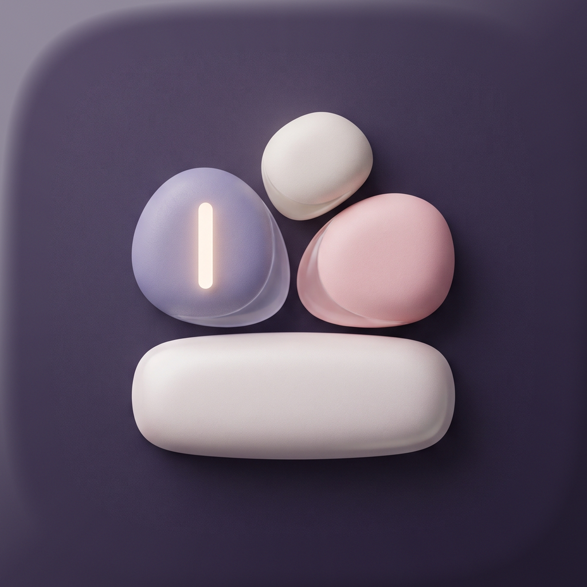

# bdsk

<p align="center">
  
</p>

<p align="center">
  <strong>받아쓰기.</strong> macOS 메뉴바에서 말하면, 조사가 붙은 말도 사전이 알아듣습니다.
</p>

한국어로 받아쓰기를 쓰다 보면 같은 자리에서 반복해서 막힙니다. 고유명사는 한글로 나오고, 조사는 어간에 붙습니다. `노션으로`, `노션에서는`. 공백으로 단어를 나누는 사전은 표제어 `노션`을 넣어 둬도 그 다음 글자를 다른 단어로 봅니다. 조사마다 항목을 복제하면 엔진이 받을 수 있는 힌트(최대 100개)를 금방 채웁니다.

bdsk는 그 간극을 메우려고 만든 작은 앱입니다. 전사는 기기 안의 Apple SpeechAnalyzer(`ko-KR`)가 하고, 사전은 어간만 등록합니다. 조사는 코드가 남깁니다. 결과는 클립보드에 맡기지 않고 지금 있는 커서에 넣습니다.

macOS 26 이상이 필요합니다.

## 설치

[Releases](https://github.com/narnia-ai-mason/bdsk/releases)에서 `bdsk-*-macos.dmg`를 받아 엽니다. `bdsk`를 Applications로 끌어다 놓으면 됩니다.

Apple Developer ID로 서명하지 않았으므로, 처음에는 **응용 프로그램의 bdsk를 우클릭 → 열기**로 실행하세요. 더블클릭만 하면 Gatekeeper가 막을 수 있습니다.

앱은 Dock에 상주하지 않습니다. 메뉴막대 아이콘이 켜진 표시입니다. 처음 실행하면 마이크, 음성 인식, 손쉬운 사용을 묻고, 이 맥에 한국어 받아쓰기 엔진이 없으면 받을지 확인합니다.

배포용 dmg를 다시 만들 때는 `scripts/package-release.sh`를 실행합니다.

## 특징

- **조사 보존 사전.** `스위프트 데이터로` → `SwiftData로`, `스위프트 데이터에서는` → `SwiftData에서는`. `에서`+`는`처럼 겹친 조사도 이어서 먹습니다. 조사가 아닌 한글이 이어지면 치환하지 않습니다 (`스위프트 데이터링`).
- **어간만 등록.** 공백 있는 표제어는 공백 없는 형태도 같이 봅니다. Apple `contextualStrings`에는 조사 확장형 없이 어간 최대 100개만 넣습니다.
- **하이브리드 핫키.** 짧게 누르면 토글, 길게 누르면 누르는 동안만 녹음. 키를 누르는 순간 녹음을 시작하고, 길게 누르기 기준(200–400ms)은 녹음이 준비된 뒤부터 셉니다. 기본값은 Control+Space입니다. 입력 소스 전환과 겹치면 설정에서 바꿉니다.
- **커서에 삽입.** 손쉬운 사용으로 선택된 텍스트를 쓰고, 필드가 안 바뀌면 클립보드 + Command+V 후 클립보드를 되돌립니다. 한글을 한 글자씩 치지 않습니다.
- **온디바이스.** 말이 기기를 떠나지 않습니다. 메뉴바 아이콘이 녹음 중인지 알려 줍니다. 설정 창이 열려 있을 때만 Command+Tab 목록에 나타납니다.

아직 없는 것: 히스토리에서 수정 학습, 스니펫, 플러그인, 클라우드, 영어 로케일 전환.

## 사전

설정에서 치환과 표제어(쉼표로 alias)를 등록합니다. NFC로 정규화하고, 긴 표제어부터 맞춥니다. 저장 위치는 `~/Library/Application Support/dev.bdsk.app/lexicon.json`입니다.

## 권한

| 권한 | 용도 |
| --- | --- |
| 마이크 | 녹음 |
| 음성 인식 | 온디바이스 전사 |
| 손쉬운 사용 | 전역 핫키, 커서 삽입 |
| 한국어 엔진 | Apple이 기기 안에 두는 받아쓰기 자산. macOS 26에도 없을 수 있어, 첫 실행에서 받습니다. |

시스템 설정 스위치가 켜져 있어도, Xcode가 방금 빌드한 복사본에는 아직 안 먹을 수 있습니다. 손쉬운 사용에서 bdsk를 끈 뒤 앱을 완전히 종료하고 다시 실행한 다음, 목록에 새로 나타난 항목을 켭니다. 켠 뒤에도 한 번 더 종료 후 실행합니다.

Xcode 디버거가 붙어 있으면 macOS가 전역 핫키를 막습니다. 스킴 `bdsk`는 Debug executable을 끈 상태로 두었습니다.

## 실행

Xcode 26에서 `bdsk.xcodeproj`를 열고 스킴 **bdsk**, 대상 **My Mac**, Run.

```bash
xcodebuild -project bdsk.xcodeproj -scheme bdsk \
  -destination 'platform=macOS,arch=arm64' \
  -derivedDataPath build build
```

앱은 Dock에 상주하지 않습니다. 메뉴막대 아이콘이 켜진 표시입니다. 설정은 아이콘 → 설정….

## 테스트

조사 보존·최장일치·alias 계약은 XCTest로 고정합니다.

```bash
xcodebuild -project bdsk.xcodeproj -scheme bdsk \
  -destination 'platform=macOS,arch=arm64' \
  -derivedDataPath build test
```

## 소스

| 경로 | 역할 |
| --- | --- |
| `bdsk/App` | 메뉴바, 설정 창, 권한, Command+Tab용 activation policy |
| `bdsk/Hotkey` | 전역 핫키 (CGEvent tap) |
| `bdsk/Dictation` | `AVAudioEngine` → SpeechAnalyzer |
| `bdsk/Lexicon` | 조사 테이블, 치환, `lexicon.json` |
| `bdsk/Insertion` | AX 삽입, Command+V 폴백 |
| `bdsk/Settings` | 핫키 녹음, 사전 CRUD |
| `bdskTests` | `ParticleAwareReplacer` |
| `bench/apple` | SpeechAnalyzer 파일 전사 벤치. 앱 런타임에 넣지 않습니다. |

번들 ID는 `dev.bdsk.app`입니다. 시각 언어는 [DESIGN.md](DESIGN.md)에 있습니다.
