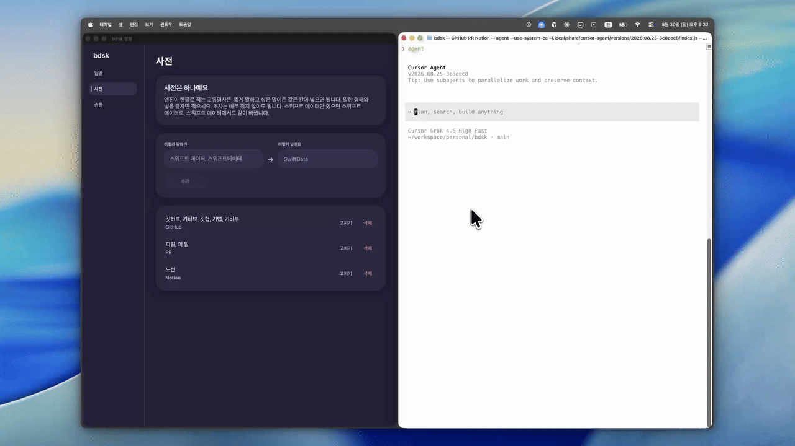
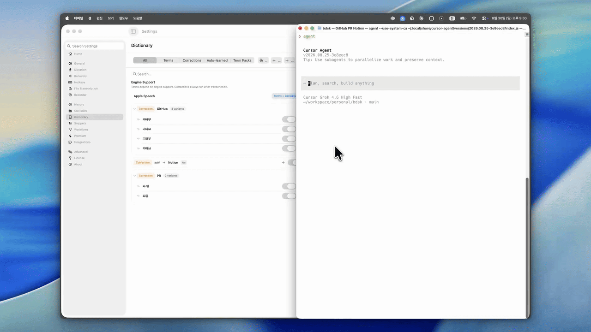

# bdsk

<p align="center">
  
</p>

<p align="center">
  <strong>On-device speech-to-text for macOS.</strong><br>
  Cursor에 한국어로 말하면, 조사까지 남습니다.
</p>

<p align="center">
  <a href="https://github.com/narnia-ai-mason/bdsk/releases/latest"><strong>다운로드</strong></a>
  · macOS 26+ · Apple Silicon
</p>

단어만 말하면 사전이 됩니다. `깃허브에`처럼 조사가 붙으면 표제어를 놓칩니다.

| bdsk | TypeWhisper |
| :---: | :---: |
|  |  |

바이브 코딩할 때 프롬프트를 타이핑하지 않고 말합니다. `노션으로`, `커서로`, `스위프트 데이터에서는`. 공백으로 단어를 나누는 사전은 표제어 `노션`을 넣어 둬도 그 다음 글자를 다른 단어로 봅니다. 조사마다 항목을 복제하면 엔진이 받을 수 있는 힌트(최대 100개)를 금방 채웁니다.

bdsk는 어간만 등록합니다. 조사는 코드가 남깁니다. 전사는 기기 안의 Apple SpeechAnalyzer(`ko-KR`)가 하고, 텍스트는 지금 있는 커서에 들어갑니다.

## 하는 일

- **조사까지 치환.** `스위프트 데이터로` → `SwiftData로`, `스위프트 데이터에서는` → `SwiftData에서는`. `에서`+`는`처럼 겹친 조사도 이어서 먹습니다. 조사가 아니면 그대로 둡니다 (`스위프트 데이터링`).
- **온디바이스.** 말이 맥을 떠나지 않습니다.
- **커서에 바로.** 클립보드에 쌓아두지 않습니다. 필드가 안 바뀌면 붙여넣기 후 클립보드를 되돌립니다.
- **누르면 녹음.** 짧게 누르면 토글, 길게 누르면 누르는 동안만. 기본 핫키는 Control+Space입니다.

아직 없는 것: 히스토리에서 수정 학습, 스니펫, 플러그인, 클라우드, 영어 로케일 전환.

## 설치

[Releases](https://github.com/narnia-ai-mason/bdsk/releases/latest)에서 `bdsk-*-macos.dmg`를 받아 엽니다. `bdsk`를 Applications로 끌어다 놓으면 됩니다.

Apple Developer ID로 서명하지 않았으므로, 처음에는 **응용 프로그램의 bdsk를 우클릭 → 열기**로 실행하세요. 더블클릭만 하면 Gatekeeper가 막을 수 있습니다.

앱은 Dock에 상주하지 않습니다. 메뉴막대 아이콘이 켜진 표시입니다. 처음 실행하면 마이크, 음성 인식, 손쉬운 사용을 묻고, 이 맥에 한국어 받아쓰기 엔진이 없으면 받을지 확인합니다.

## 사전

설정에서 치환과 표제어(쉼표로 alias)를 등록합니다. 어간만 넣으면 됩니다. 공백 있는 표제어는 공백 없는 형태도 같이 봅니다. 저장 위치는 `~/Library/Application Support/dev.bdsk.app/lexicon.json`입니다.

## 권한

| 권한 | 용도 |
| --- | --- |
| 마이크 | 녹음 |
| 음성 인식 | 온디바이스 전사 |
| 손쉬운 사용 | 전역 핫키, 커서 삽입 |
| 한국어 엔진 | Apple이 기기 안에 두는 받아쓰기 자산. macOS 26에도 없을 수 있어, 첫 실행에서 받습니다. |

## 소스에서 빌드

Xcode 26에서 `bdsk.xcodeproj`를 열고 스킴 **bdsk**, 대상 **My Mac**, Run.

```bash
xcodebuild -project bdsk.xcodeproj -scheme bdsk \
  -destination 'platform=macOS,arch=arm64' \
  -derivedDataPath build build
```

```bash
xcodebuild -project bdsk.xcodeproj -scheme bdsk \
  -destination 'platform=macOS,arch=arm64' \
  -derivedDataPath build test
```

배포용 dmg는 `scripts/package-release.sh`입니다.

시스템 설정 스위치가 켜져 있어도, Xcode가 방금 빌드한 복사본에는 손쉬운 사용이 안 먹을 수 있습니다. 목록에서 bdsk를 끈 뒤 앱을 완전히 종료하고, 새로 나타난 항목을 켭니다. 켠 뒤에도 한 번 더 종료 후 실행합니다. Xcode 디버거가 붙어 있으면 macOS가 전역 핫키를 막습니다. 스킴 `bdsk`는 Debug executable을 끈 상태로 두었습니다.

| 경로 | 역할 |
| --- | --- |
| `bdsk/App` | 메뉴바, 설정 창, 권한, Command+Tab용 activation policy |
| `bdsk/Hotkey` | 전역 핫키 (CGEvent tap) |
| `bdsk/Dictation` | `AVAudioEngine` → SpeechAnalyzer |
| `bdsk/Lexicon` | 조사 테이블, 치환, `lexicon.json` |
| `bdsk/Insertion` | AX 삽입, Command+V 폴백 |
| `bdsk/Settings` | 핫키 녹음, 사전 CRUD |
| `bdskTests` | `ParticleAwareReplacer` |
| `bench/apple` | SpeechAnalyzer 파일 전사 벤치. 앱 런타임에 넣지 않습니다. |
| `docs` | README 로고, TypeWhisper 비교 GIF |

번들 ID는 `dev.bdsk.app`입니다. 시각 언어는 [DESIGN.md](DESIGN.md)에 있습니다.
